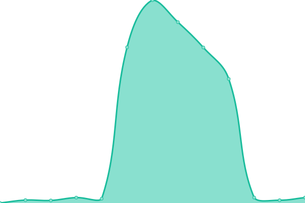
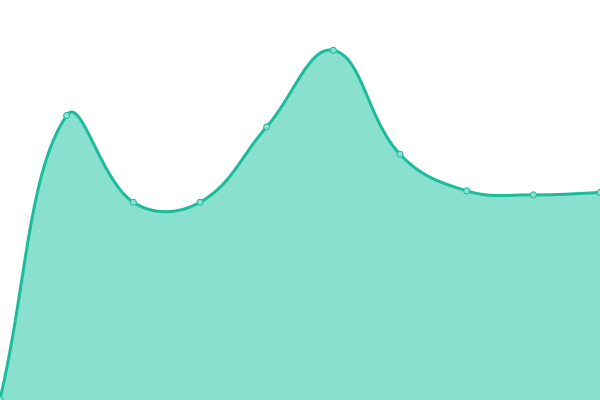

# [📈 Live Status](https://cotezos.github.io/teznodes): <!--live status--> **🟧 Partial outage**

This repository contains the open-source uptime monitor and status page for [cotezos](https://cotezos.github.io/teznodes), powered by [Upptime](https://github.com/upptime/upptime).

With [Upptime](https://upptime.js.org), you can get your own unlimited and free uptime monitor and status page, powered entirely by a GitHub repository. We use [Issues](https://github.com/cotezos/teznodes/issues) as incident reports, [Actions](https://github.com/cotezos/teznodes/actions) as uptime monitors, and [Pages](https://cotezos.github.io/teznodes) for the status page.

<!--start: status pages-->
<!-- This summary is generated by Upptime (https://github.com/upptime/upptime) -->
<!-- Do not edit this manually, your changes will be overwritten -->
<!-- prettier-ignore -->
| URL | Status | History | Response Time | Uptime |
| --- | ------ | ------- | ------------- | ------ |
|  [Mainnet tez.ie [ECAD Labs] (api.tez.ie/rpc/mainnet)](https://api.tez.ie/rpc/mainnet/chains/main/blocks/head) | 🟩 Up | [mainnet-tez-ie-ecad-labs-api-tez-ie-rpc-mainnet.yml](https://github.com/cotezos/teznodes/commits/HEAD/history/mainnet-tez-ie-ecad-labs-api-tez-ie-rpc-mainnet.yml) | 

 691ms
     
 | 

<a href="https://cotezos.github.io/teznodes/history/mainnet-tez-ie-ecad-labs-api-tez-ie-rpc-mainnet">100.00%</a>
    

|  [Mainnet Smartpy (mainnet.smartpy.io)](https://mainnet.smartpy.io/chains/main/blocks/head/header) | 🟩 Up | [mainnet-smartpy-mainnet-smartpy-io.yml](https://github.com/cotezos/teznodes/commits/HEAD/history/mainnet-smartpy-mainnet-smartpy-io.yml) | 

 540ms
     
 | 

<a href="https://cotezos.github.io/teznodes/history/mainnet-smartpy-mainnet-smartpy-io">97.70%</a>
    

|  [Mainnet [Marigold] (mainnet.tezos.marigold.dev)](https://mainnet.tezos.marigold.dev/chains/main/blocks/head/header) | 🟥 Down | [mainnet-marigold-mainnet-tezos-marigold-dev.yml](https://github.com/cotezos/teznodes/commits/HEAD/history/mainnet-marigold-mainnet-tezos-marigold-dev.yml) | 

 386ms
     
 | 

<a href="https://cotezos.github.io/teznodes/history/mainnet-marigold-mainnet-tezos-marigold-dev">99.81%</a>
    

|  [Mainnet [Tezos Foundation] (rpc.tzbeta.net)](https://rpc.tzbeta.net/) | 🟥 Down | [mainnet-tezos-foundation-rpc-tzbeta-net.yml](https://github.com/cotezos/teznodes/commits/HEAD/history/mainnet-tezos-foundation-rpc-tzbeta-net.yml) | 

 291ms
     
 | 

<a href="https://cotezos.github.io/teznodes/history/mainnet-tezos-foundation-rpc-tzbeta-net">100.00%</a>
    

|  [Ghostnet [ECAD Labs] (ghostnet.ecadinfra.com)](https://ghostnet.ecadinfra.com/chains/main/blocks/head/header) | 🟩 Up | [ghostnet-ecad-labs-ghostnet-ecadinfra-com.yml](https://github.com/cotezos/teznodes/commits/HEAD/history/ghostnet-ecad-labs-ghostnet-ecadinfra-com.yml) | 

 193ms
     
 | 

<a href="https://cotezos.github.io/teznodes/history/ghostnet-ecad-labs-ghostnet-ecadinfra-com">100.00%</a>
    

|  [Ghostnet [SmartPy] (ghostnet.smartpy.io)](https://ghostnet.smartpy.io/chains/main/blocks/head/header) | 🟩 Up | [ghostnet-smart-py-ghostnet-smartpy-io.yml](https://github.com/cotezos/teznodes/commits/HEAD/history/ghostnet-smart-py-ghostnet-smartpy-io.yml) | 

 534ms
     
 | 

<a href="https://cotezos.github.io/teznodes/history/ghostnet-smart-py-ghostnet-smartpy-io">100.00%</a>
    

|  [Ghostnet [Marigold] (ghostnet.tezos.marigold.dev)](https://ghostnet.tezos.marigold.dev/chains/main/blocks/head/header) | 🟩 Up | [ghostnet-marigold-ghostnet-tezos-marigold-dev.yml](https://github.com/cotezos/teznodes/commits/HEAD/history/ghostnet-marigold-ghostnet-tezos-marigold-dev.yml) | 

 367ms
     
 | 

<a href="https://cotezos.github.io/teznodes/history/ghostnet-marigold-ghostnet-tezos-marigold-dev">100.00%</a>
    

<!--end: status pages-->

[**Visit our status website →**](https://cotezos.github.io/teznodes)

## 📄 License

- Powered by: [Upptime](https://github.com/upptime/upptime)
- Code: [MIT](./LICENSE) © [cotezos](https://cotezos.github.io/teznodes)
- Data in the `./history` directory: [Open Database License](https://opendatacommons.org/licenses/odbl/1-0/)
