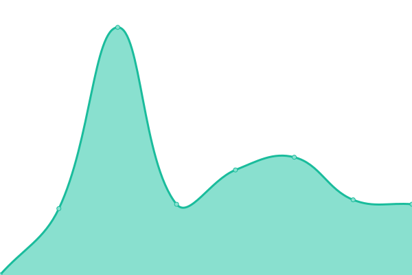
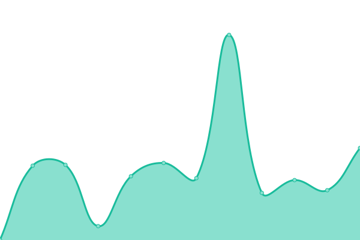

# [📈 Live Status](https://cotezos.github.io/teznodes): <!--live status--> **🟧 Partial outage**

This repository contains the open-source uptime monitor and status page for [cotezos](https://cotezos.github.io/teznodes), powered by [Upptime](https://github.com/upptime/upptime).

With [Upptime](https://upptime.js.org), you can get your own unlimited and free uptime monitor and status page, powered entirely by a GitHub repository. We use [Issues](https://github.com/cotezos/teznodes/issues) as incident reports, [Actions](https://github.com/cotezos/teznodes/actions) as uptime monitors, and [Pages](https://cotezos.github.io/teznodes) for the status page.

<!--start: status pages-->
<!-- This summary is generated by Upptime (https://github.com/upptime/upptime) -->
<!-- Do not edit this manually, your changes will be overwritten -->
<!-- prettier-ignore -->
| URL | Status | History | Response Time | Uptime |
| --- | ------ | ------- | ------------- | ------ |
|  [Mainnet Giganode](https://mainnet-tezos.giganode.io/chains/main/blocks/head) | 🟩 Up | [mainnet-giganode.yml](https://github.com/cotezos/teznodes/commits/HEAD/history/mainnet-giganode.yml) | 

 2470ms
     
 | 

<a href="https://cotezos.github.io/teznodes/history/mainnet-giganode">98.64%</a>
    

|  [Mainnet tez.ie](https://api.tez.ie/rpc/mainnet/chains/main/blocks/head) | 🟩 Up | [mainnet-tez-ie.yml](https://github.com/cotezos/teznodes/commits/HEAD/history/mainnet-tez-ie.yml) | 

 2294ms
     
 | 

<a href="https://cotezos.github.io/teznodes/history/mainnet-tez-ie">100.00%</a>
    

|  [Mainnet Smartpy](https://mainnet.smartpy.io/chains/main/blocks/head/header) | 🟩 Up | [mainnet-smartpy.yml](https://github.com/cotezos/teznodes/commits/HEAD/history/mainnet-smartpy.yml) | 

 381ms
     
 | 

<a href="https://cotezos.github.io/teznodes/history/mainnet-smartpy">99.34%</a>
    

|  [Mainnet Letsbake](https://teznode.letzbake.com/chains/main/blocks/head/header) | 🟩 Up | [mainnet-letsbake.yml](https://github.com/cotezos/teznodes/commits/HEAD/history/mainnet-letsbake.yml) | 

 473ms
     
 | 

<a href="https://cotezos.github.io/teznodes/history/mainnet-letsbake">95.09%</a>
    

|  [Mainnet Tzbeta](https://rpc.tzbeta.net/chains/main/blocks/head/header) | 🟩 Up | [mainnet-tzbeta.yml](https://github.com/cotezos/teznodes/commits/HEAD/history/mainnet-tzbeta.yml) | 

 4397ms
     
 | 

<a href="https://cotezos.github.io/teznodes/history/mainnet-tzbeta">99.85%</a>
    

|  [Mainnet TezRPC](https://mainnet.tezrpc.me/chains/main/blocks/head/header) | 🟥 Down | [mainnet-tez-rpc.yml](https://github.com/cotezos/teznodes/commits/HEAD/history/mainnet-tez-rpc.yml) | 

 0ms
     
 | 

<a href="https://cotezos.github.io/teznodes/history/mainnet-tez-rpc">0.00%</a>
    

|  [florencenet Tez.ie](https://api.tez.ie/rpc/florencenet/chains/main/blocks/head/header) | 🟩 Up | [florencenet-tez-ie.yml](https://github.com/cotezos/teznodes/commits/HEAD/history/florencenet-tez-ie.yml) | 

 282ms
     
 | 

<a href="https://cotezos.github.io/teznodes/history/florencenet-tez-ie">95.71%</a>
    

|  [granadanet tez.io](https://api.tez.ie/rpc/granadanet/chains/main/blocks/head/header) | 🟩 Up | [granadanet-tez-io.yml](https://github.com/cotezos/teznodes/commits/HEAD/history/granadanet-tez-io.yml) | 

 160ms
     
 | 

<a href="https://cotezos.github.io/teznodes/history/granadanet-tez-io">100.00%</a>
    

|  [granadanet Smartpy](https://granadanet.smartpy.io/chains/main/blocks/head/header) | 🟩 Up | [granadanet-smartpy.yml](https://github.com/cotezos/teznodes/commits/HEAD/history/granadanet-smartpy.yml) | 

 413ms
     
 | 

<a href="https://cotezos.github.io/teznodes/history/granadanet-smartpy">100.00%</a>
    

|  [Testnet Giganode](https://testnet-tezos.giganode.io/chains/main/blocks/head/header) | 🟩 Up | [testnet-giganode.yml](https://github.com/cotezos/teznodes/commits/HEAD/history/testnet-giganode.yml) | 

 376ms
     
 | 

<a href="https://cotezos.github.io/teznodes/history/testnet-giganode">99.84%</a>
    

|  [hangzhounet Smartpy](https://hangzhounet.smartpy.io/chains/main/blocks/head/header) | 🟥 Down | [hangzhounet-smartpy.yml](https://github.com/cotezos/teznodes/commits/HEAD/history/hangzhounet-smartpy.yml) | 

 2437ms
     
 | 

<a href="https://cotezos.github.io/teznodes/history/hangzhounet-smartpy">99.40%</a>
    

<!--end: status pages-->

[**Visit our status website →**](https://cotezos.github.io/teznodes)

## 📄 License

- Powered by: [Upptime](https://github.com/upptime/upptime)
- Code: [MIT](./LICENSE) © [cotezos](https://cotezos.github.io/teznodes)
- Data in the `./history` directory: [Open Database License](https://opendatacommons.org/licenses/odbl/1-0/)
