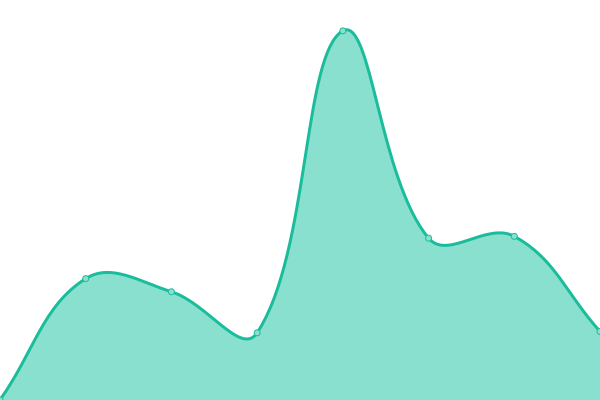
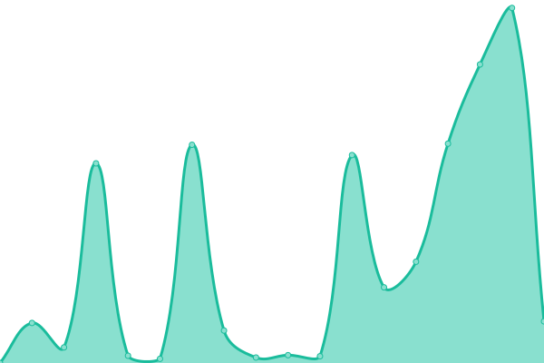
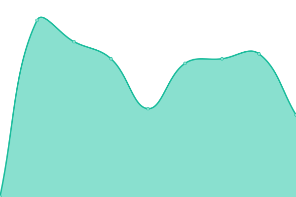

# [📈 Live Status](https://cotezos.github.io/teznodes): <!--live status--> **🟧 Partial outage**

This repository contains the open-source uptime monitor and status page for [cotezos](https://cotezos.github.io/teznodes), powered by [Upptime](https://github.com/upptime/upptime).

With [Upptime](https://upptime.js.org), you can get your own unlimited and free uptime monitor and status page, powered entirely by a GitHub repository. We use [Issues](https://github.com/cotezos/teznodes/issues) as incident reports, [Actions](https://github.com/cotezos/teznodes/actions) as uptime monitors, and [Pages](https://cotezos.github.io/teznodes) for the status page.

<!--start: status pages-->
<!-- This summary is generated by Upptime (https://github.com/upptime/upptime) -->
<!-- Do not edit this manually, your changes will be overwritten -->
<!-- prettier-ignore -->
| URL | Status | History | Response Time | Uptime |
| --- | ------ | ------- | ------------- | ------ |
|  [Mainnet Giganode [tezos Ukraine ](mainnet-tezos.giganode.io)](https://mainnet-tezos.giganode.io/chains/main/blocks/head) | 🟩 Up | [mainnet-giganode-tezos-ukraine-mainnet-tezos-giganode-io.yml](https://github.com/cotezos/teznodes/commits/HEAD/history/mainnet-giganode-tezos-ukraine-mainnet-tezos-giganode-io.yml) | 

 901ms
     
 | 

<a href="https://cotezos.github.io/teznodes/history/mainnet-giganode-tezos-ukraine-mainnet-tezos-giganode-io">100.00%</a>
    

|  [Mainnet tez.ie [ECAD Labs] (api.tez.ie/rpc/mainnet)](https://api.tez.ie/rpc/mainnet/chains/main/blocks/head) | 🟩 Up | [mainnet-tez-ie-ecad-labs-api-tez-ie-rpc-mainnet.yml](https://github.com/cotezos/teznodes/commits/HEAD/history/mainnet-tez-ie-ecad-labs-api-tez-ie-rpc-mainnet.yml) | 

 3619ms
     
 | 

<a href="https://cotezos.github.io/teznodes/history/mainnet-tez-ie-ecad-labs-api-tez-ie-rpc-mainnet">99.12%</a>
    

|  [Mainnet Smartpy (mainnet.smartpy.io)](https://mainnet.smartpy.io/chains/main/blocks/head/header) | 🟩 Up | [mainnet-smartpy-mainnet-smartpy-io.yml](https://github.com/cotezos/teznodes/commits/HEAD/history/mainnet-smartpy-mainnet-smartpy-io.yml) | 

 3063ms
     
 | 

<a href="https://cotezos.github.io/teznodes/history/mainnet-smartpy-mainnet-smartpy-io">100.00%</a>
    

|  [Mainnet Letsbake (teznode.letzbake.com)](https://teznode.letzbake.com/chains/main/blocks/head/header) | 🟥 Down | [mainnet-letsbake-teznode-letzbake-com.yml](https://github.com/cotezos/teznodes/commits/HEAD/history/mainnet-letsbake-teznode-letzbake-com.yml) | 

 0ms
     
 | 

<a href="https://cotezos.github.io/teznodes/history/mainnet-letsbake-teznode-letzbake-com">0.00%</a>
    

|  [Mainnet tzbeta.net [Blockscale]](https://rpc.tzbeta.net/chains/main/blocks/head/header) | 🟩 Up | [mainnet-tzbeta-net-blockscale.yml](https://github.com/cotezos/teznodes/commits/HEAD/history/mainnet-tzbeta-net-blockscale.yml) | 

 364ms
     
 | 

<a href="https://cotezos.github.io/teznodes/history/mainnet-tzbeta-net-blockscale">100.00%</a>
    

|  [Testnet Giganode [tezos Ukraine] (testnet-tezos.giganode.io)](https://testnet-tezos.giganode.io/chains/main/blocks/head/header) | 🟩 Up | [testnet-giganode-tezos-ukraine-testnet-tezos-giganode-io.yml](https://github.com/cotezos/teznodes/commits/HEAD/history/testnet-giganode-tezos-ukraine-testnet-tezos-giganode-io.yml) | 

 444ms
     
 | 

<a href="https://cotezos.github.io/teznodes/history/testnet-giganode-tezos-ukraine-testnet-tezos-giganode-io">100.00%</a>
    

|  [testnet tzbeta.net [Blockscale] (rpczero.tzbeta.net)](https://rpczero.tzbeta.net/chains/main/blocks/head/header) | 🟩 Up | [testnet-tzbeta-net-blockscale-rpczero-tzbeta-net.yml](https://github.com/cotezos/teznodes/commits/HEAD/history/testnet-tzbeta-net-blockscale-rpczero-tzbeta-net.yml) | 

 491ms
     
 | 

<a href="https://cotezos.github.io/teznodes/history/testnet-tzbeta-net-blockscale-rpczero-tzbeta-net">99.55%</a>
    

|  [hangzhounet Smartpy (hangzhounet.smartpy.io)](https://hangzhounet.smartpy.io/chains/main/blocks/head/header) | 🟥 Down | [hangzhounet-smartpy-hangzhounet-smartpy-io.yml](https://github.com/cotezos/teznodes/commits/HEAD/history/hangzhounet-smartpy-hangzhounet-smartpy-io.yml) | 

 434ms
     
 | 

<a href="https://cotezos.github.io/teznodes/history/hangzhounet-smartpy-hangzhounet-smartpy-io">0.00%</a>
    

|  [Mainnet [krypstar] (tezos-node.kryptstar.com)](https://tezos-node.kryptstar.com/chains/main/blocks/head/header) | 🟩 Up | [mainnet-krypstar-tezos-node-kryptstar-com.yml](https://github.com/cotezos/teznodes/commits/HEAD/history/mainnet-krypstar-tezos-node-kryptstar-com.yml) | 

 241ms
     
 | 

<a href="https://cotezos.github.io/teznodes/history/mainnet-krypstar-tezos-node-kryptstar-com">100.00%</a>
    

<!--end: status pages-->

[**Visit our status website →**](https://cotezos.github.io/teznodes)

## 📄 License

- Powered by: [Upptime](https://github.com/upptime/upptime)
- Code: [MIT](./LICENSE) © [cotezos](https://cotezos.github.io/teznodes)
- Data in the `./history` directory: [Open Database License](https://opendatacommons.org/licenses/odbl/1-0/)
