# [📈 Live Status](https://cotezos.github.io/teznodes): <!--live status--> **🟧 Partial outage**

This repository contains the open-source uptime monitor and status page for [cotezos](https://cotezos.github.io/teznodes), powered by [Upptime](https://github.com/upptime/upptime).

With [Upptime](https://upptime.js.org), you can get your own unlimited and free uptime monitor and status page, powered entirely by a GitHub repository. We use [Issues](https://github.com/cotezos/teznodes/issues) as incident reports, [Actions](https://github.com/cotezos/teznodes/actions) as uptime monitors, and [Pages](https://cotezos.github.io/teznodes) for the status page.

## Stargazers over time

<!--start: status pages-->
<!-- This summary is generated by Upptime (https://github.com/upptime/upptime) -->
<!-- Do not edit this manually, your changes will be overwritten -->
<!-- prettier-ignore -->
| URL | Status | History | Response Time | Uptime |
| --- | ------ | ------- | ------------- | ------ |
|  [bakingnet [tezosfoundation] (https://rpc.bakingnet.teztnets.com)](https://rpc.bakingnet.teztnets.com/chains/main/blocks/head/header) | 🟩 Up | [bakingnet-tezosfoundation-https-rpc-bakingnet-teztnets-com.yml](https://github.com/cotezos/teznodes/commits/HEAD/history/bakingnet-tezosfoundation-https-rpc-bakingnet-teztnets-com.yml) | 

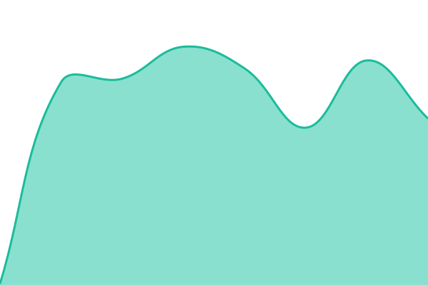 177ms
     
 | 

<a href="https://cotezos.github.io/teznodes/history/bakingnet-tezosfoundation-https-rpc-bakingnet-teztnets-com">100.00%</a>
    

|  [mainnet [octez] (https://octez-mainnet-archive.octez.io)](https://octez-mainnet-archive.octez.io/chains/main/blocks/head/header) | 🟩 Up | [mainnet-octez-https-octez-mainnet-archive-octez-io.yml](https://github.com/cotezos/teznodes/commits/HEAD/history/mainnet-octez-https-octez-mainnet-archive-octez-io.yml) | 

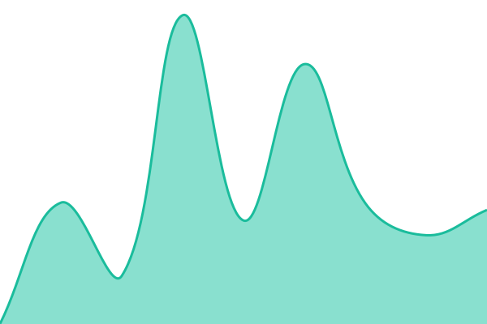 830ms
     
 | 

<a href="https://cotezos.github.io/teznodes/history/mainnet-octez-https-octez-mainnet-archive-octez-io">99.37%</a>
    

|  [mainnet [smartpy] (https://mainnet.smartpy.io)](https://mainnet.smartpy.io/chains/main/blocks/head/header) | 🟩 Up | [mainnet-smartpy-https-mainnet-smartpy-io.yml](https://github.com/cotezos/teznodes/commits/HEAD/history/mainnet-smartpy-https-mainnet-smartpy-io.yml) | 

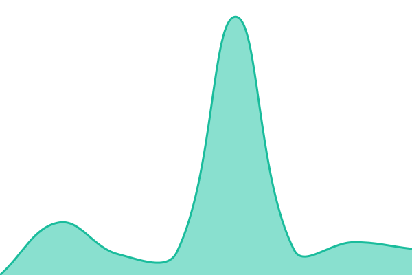 1051ms
     
 | 

<a href="https://cotezos.github.io/teznodes/history/mainnet-smartpy-https-mainnet-smartpy-io">100.00%</a>
    

|  [mainnet [tezos_commons] (https://tcinfra.net)](https://tcinfra.net/chains/main/blocks/head/header) | 🟩 Up | [mainnet-tezos-commons-https-tcinfra-net.yml](https://github.com/cotezos/teznodes/commits/HEAD/history/mainnet-tezos-commons-https-tcinfra-net.yml) | 

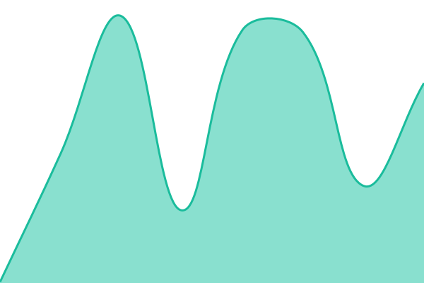 165ms
     
 | 

<a href="https://cotezos.github.io/teznodes/history/mainnet-tezos-commons-https-tcinfra-net">100.00%</a>
    

|  [mainnet [tezosfoundation] (https://rpc.tzbeta.net)](https://rpc.tzbeta.net/chains/main/blocks/head/header) | 🟩 Up | [mainnet-tezosfoundation-https-rpc-tzbeta-net.yml](https://github.com/cotezos/teznodes/commits/HEAD/history/mainnet-tezosfoundation-https-rpc-tzbeta-net.yml) | 

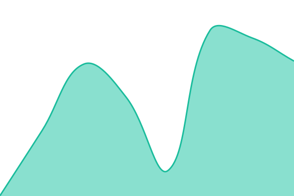 341ms
     
 | 

<a href="https://cotezos.github.io/teznodes/history/mainnet-tezosfoundation-https-rpc-tzbeta-net">100.00%</a>
    

|  [mainnet [trilitech] (https://tezos-mainnet.octez.io)](https://tezos-mainnet.octez.io/chains/main/blocks/head/header) | 🟩 Up | [mainnet-trilitech-https-tezos-mainnet-octez-io.yml](https://github.com/cotezos/teznodes/commits/HEAD/history/mainnet-trilitech-https-tezos-mainnet-octez-io.yml) | 

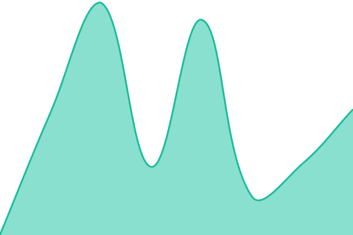 790ms
     
 | 

<a href="https://cotezos.github.io/teznodes/history/mainnet-trilitech-https-tezos-mainnet-octez-io">100.00%</a>
    

|  [mainnet [tzkt] (https://rpc.tzkt.io/mainnet)](https://rpc.tzkt.io/mainnet/chains/main/blocks/head/header) | 🟩 Up | [mainnet-tzkt-https-rpc-tzkt-io-mainnet.yml](https://github.com/cotezos/teznodes/commits/HEAD/history/mainnet-tzkt-https-rpc-tzkt-io-mainnet.yml) | 

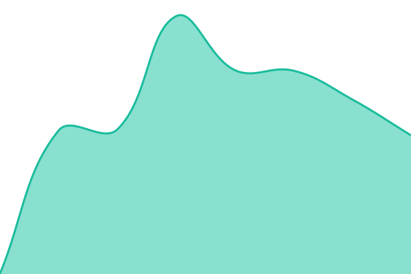 698ms
     
 | 

<a href="https://cotezos.github.io/teznodes/history/mainnet-tzkt-https-rpc-tzkt-io-mainnet">100.00%</a>
    

|  [shadownet [octez] (https://octez-shadownet-archive.octez.io)](https://octez-shadownet-archive.octez.io/chains/main/blocks/head/header) | 🟩 Up | [shadownet-octez-https-octez-shadownet-archive-octez-io.yml](https://github.com/cotezos/teznodes/commits/HEAD/history/shadownet-octez-https-octez-shadownet-archive-octez-io.yml) | 

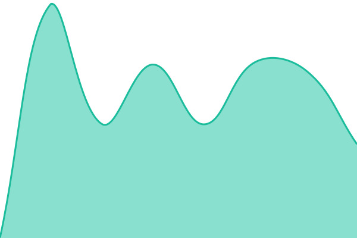 544ms
     
 | 

<a href="https://cotezos.github.io/teznodes/history/shadownet-octez-https-octez-shadownet-archive-octez-io">100.00%</a>
    

|  [shadownet [smartpy] (https://shadownet.smartpy.io)](https://shadownet.smartpy.io/chains/main/blocks/head/header) | 🟩 Up | [shadownet-smartpy-https-shadownet-smartpy-io.yml](https://github.com/cotezos/teznodes/commits/HEAD/history/shadownet-smartpy-https-shadownet-smartpy-io.yml) | 

 536ms
     
 | 

<a href="https://cotezos.github.io/teznodes/history/shadownet-smartpy-https-shadownet-smartpy-io">100.00%</a>
    

|  [shadownet [tezosfoundation] (https://rpc.shadownet.teztnets.com)](https://rpc.shadownet.teztnets.com/chains/main/blocks/head/header) | 🟩 Up | [shadownet-tezosfoundation-https-rpc-shadownet-teztnets-com.yml](https://github.com/cotezos/teznodes/commits/HEAD/history/shadownet-tezosfoundation-https-rpc-shadownet-teztnets-com.yml) | 

 177ms
     
 | 

<a href="https://cotezos.github.io/teznodes/history/shadownet-tezosfoundation-https-rpc-shadownet-teztnets-com">100.00%</a>
    

|  [shadownet [trilitech] (https://tezos-shadownet.octez.io)](https://tezos-shadownet.octez.io/chains/main/blocks/head/header) | 🟩 Up | [shadownet-trilitech-https-tezos-shadownet-octez-io.yml](https://github.com/cotezos/teznodes/commits/HEAD/history/shadownet-trilitech-https-tezos-shadownet-octez-io.yml) | 

 445ms
     
 | 

<a href="https://cotezos.github.io/teznodes/history/shadownet-trilitech-https-tezos-shadownet-octez-io">100.00%</a>
    

|  [shadownet [tzkt] (https://rpc.tzkt.io/shadownet)](https://rpc.tzkt.io/shadownet/chains/main/blocks/head/header) | 🟩 Up | [shadownet-tzkt-https-rpc-tzkt-io-shadownet.yml](https://github.com/cotezos/teznodes/commits/HEAD/history/shadownet-tzkt-https-rpc-tzkt-io-shadownet.yml) | 

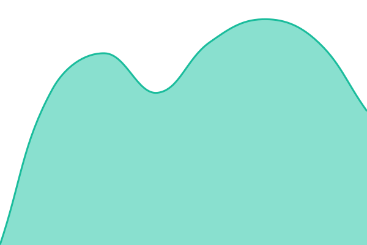 593ms
     
 | 

<a href="https://cotezos.github.io/teznodes/history/shadownet-tzkt-https-rpc-tzkt-io-shadownet">100.00%</a>
    

|  [snet [tezosfoundation] (https://rpc.snet.teztnets.com)](https://rpc.snet.teztnets.com/chains/main/blocks/head/header) | 🟩 Up | [snet-tezosfoundation-https-rpc-snet-teztnets-com.yml](https://github.com/cotezos/teznodes/commits/HEAD/history/snet-tezosfoundation-https-rpc-snet-teztnets-com.yml) | 

 185ms
     
 | 

<a href="https://cotezos.github.io/teznodes/history/snet-tezosfoundation-https-rpc-snet-teztnets-com">100.00%</a>
    

|  [ushuaianet [tezosfoundation] (https://rpc.ushuaianet.teztnets.com)](https://rpc.ushuaianet.teztnets.com/chains/main/blocks/head/header) | 🟩 Up | [ushuaianet-tezosfoundation-https-rpc-ushuaianet-teztnets-com.yml](https://github.com/cotezos/teznodes/commits/HEAD/history/ushuaianet-tezosfoundation-https-rpc-ushuaianet-teztnets-com.yml) | 

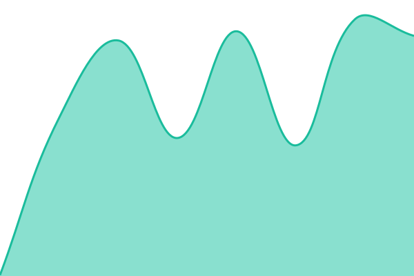 169ms
     
 | 

<a href="https://cotezos.github.io/teznodes/history/ushuaianet-tezosfoundation-https-rpc-ushuaianet-teztnets-com">100.00%</a>
    

|  [ushuaianet [trilitech] (https://tezos-ushuaianet.octez.io)](https://tezos-ushuaianet.octez.io/chains/main/blocks/head/header) | 🟥 Down | [ushuaianet-trilitech-https-tezos-ushuaianet-octez-io.yml](https://github.com/cotezos/teznodes/commits/HEAD/history/ushuaianet-trilitech-https-tezos-ushuaianet-octez-io.yml) | 

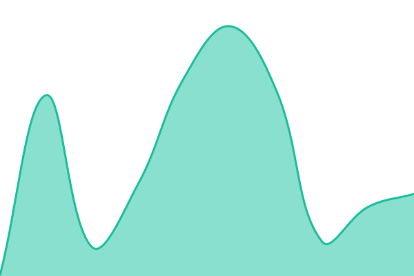 177ms
     
 | 

<a href="https://cotezos.github.io/teznodes/history/ushuaianet-trilitech-https-tezos-ushuaianet-octez-io">100.00%</a>
    

|  [ushuaianet [tzkt] (https://rpc.tzkt.io/ushuaianet)](https://rpc.tzkt.io/ushuaianet/chains/main/blocks/head/header) | 🟩 Up | [ushuaianet-tzkt-https-rpc-tzkt-io-ushuaianet.yml](https://github.com/cotezos/teznodes/commits/HEAD/history/ushuaianet-tzkt-https-rpc-tzkt-io-ushuaianet.yml) | 

 849ms
     
 | 

<a href="https://cotezos.github.io/teznodes/history/ushuaianet-tzkt-https-rpc-tzkt-io-ushuaianet">100.00%</a>
    

<!--end: status pages-->

[**Visit our status website →**](https://cotezos.github.io/teznodes)

## 📄 License

- Powered by: [Upptime](https://github.com/upptime/upptime)
- Code: [MIT](./LICENSE) © [cotezos](https://cotezos.github.io/teznodes)
- Data in the `./history` directory: [Open Database License](https://opendatacommons.org/licenses/odbl/1-0/)
