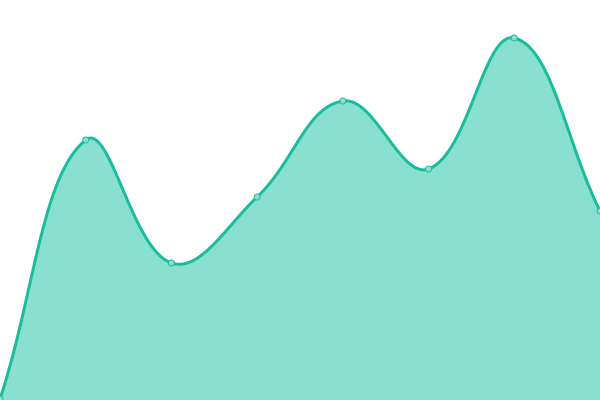
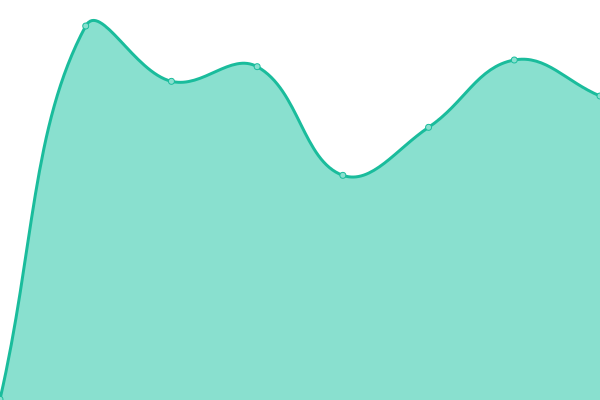

# [📈 Live Status](https://cotezos.github.io/teznodes): <!--live status--> **🟩 All systems operational**

This repository contains the open-source uptime monitor and status page for [cotezos](https://cotezos.github.io/teznodes), powered by [Upptime](https://github.com/upptime/upptime).

With [Upptime](https://upptime.js.org), you can get your own unlimited and free uptime monitor and status page, powered entirely by a GitHub repository. We use [Issues](https://github.com/cotezos/teznodes/issues) as incident reports, [Actions](https://github.com/cotezos/teznodes/actions) as uptime monitors, and [Pages](https://cotezos.github.io/teznodes) for the status page.

## Stargazers over time

<!--start: status pages-->
<!-- This summary is generated by Upptime (https://github.com/upptime/upptime) -->
<!-- Do not edit this manually, your changes will be overwritten -->
<!-- prettier-ignore -->
| URL | Status | History | Response Time | Uptime |
| --- | ------ | ------- | ------------- | ------ |
|  [mainnet [ecadinfra] (https://mainnet.tezos.ecadinfra.com)](https://mainnet.tezos.ecadinfra.com/chains/main/blocks/head/header) | 🟩 Up | [mainnet-ecadinfra-https-mainnet-tezos-ecadinfra-com.yml](https://github.com/cotezos/teznodes/commits/HEAD/history/mainnet-ecadinfra-https-mainnet-tezos-ecadinfra-com.yml) | 

 255ms
     
 | 

<a href="https://cotezos.github.io/teznodes/history/mainnet-ecadinfra-https-mainnet-tezos-ecadinfra-com">100.00%</a>
    

|  [ghostnet [ecadinfra] (https://ghostnet.tezos.ecadinfra.com)](https://ghostnet.tezos.ecadinfra.com/chains/main/blocks/head/header) | 🟩 Up | [ghostnet-ecadinfra-https-ghostnet-tezos-ecadinfra-com.yml](https://github.com/cotezos/teznodes/commits/HEAD/history/ghostnet-ecadinfra-https-ghostnet-tezos-ecadinfra-com.yml) | 

 252ms
     
 | 

<a href="https://cotezos.github.io/teznodes/history/ghostnet-ecadinfra-https-ghostnet-tezos-ecadinfra-com">100.00%</a>
    

|  [mainnet [smartpy] (https://mainnet.smartpy.io)](https://mainnet.smartpy.io/chains/main/blocks/head/header) | 🟩 Up | [mainnet-smartpy-https-mainnet-smartpy-io.yml](https://github.com/cotezos/teznodes/commits/HEAD/history/mainnet-smartpy-https-mainnet-smartpy-io.yml) | 

 306ms
     
 | 

<a href="https://cotezos.github.io/teznodes/history/mainnet-smartpy-https-mainnet-smartpy-io">100.00%</a>
    

|  [ghostnet [smartpy] (https://ghostnet.smartpy.io)](https://ghostnet.smartpy.io/chains/main/blocks/head/header) | 🟩 Up | [ghostnet-smartpy-https-ghostnet-smartpy-io.yml](https://github.com/cotezos/teznodes/commits/HEAD/history/ghostnet-smartpy-https-ghostnet-smartpy-io.yml) | 

 323ms
     
 | 

<a href="https://cotezos.github.io/teznodes/history/ghostnet-smartpy-https-ghostnet-smartpy-io">100.00%</a>
    

|  [mainnet [tezosfoundation] (https://rpc.tzbeta.net)](https://rpc.tzbeta.net/chains/main/blocks/head/header) | 🟩 Up | [mainnet-tezosfoundation-https-rpc-tzbeta-net.yml](https://github.com/cotezos/teznodes/commits/HEAD/history/mainnet-tezosfoundation-https-rpc-tzbeta-net.yml) | 

 445ms
     
 | 

<a href="https://cotezos.github.io/teznodes/history/mainnet-tezosfoundation-https-rpc-tzbeta-net">100.00%</a>
    

|  [ghostnet [tezosfoundation] (https://rpc.ghostnet.teztnets.com)](https://rpc.ghostnet.teztnets.com/chains/main/blocks/head/header) | 🟩 Up | [ghostnet-tezosfoundation-https-rpc-ghostnet-teztnets-com.yml](https://github.com/cotezos/teznodes/commits/HEAD/history/ghostnet-tezosfoundation-https-rpc-ghostnet-teztnets-com.yml) | 

 232ms
     
 | 

<a href="https://cotezos.github.io/teznodes/history/ghostnet-tezosfoundation-https-rpc-ghostnet-teztnets-com">100.00%</a>
    

|  [rionet [tezosfoundation] (https://rpc.rionet.teztnets.com)](https://rpc.rionet.teztnets.com/chains/main/blocks/head/header) | 🟩 Up | [rionet-tezosfoundation-https-rpc-rionet-teztnets-com.yml](https://github.com/cotezos/teznodes/commits/HEAD/history/rionet-tezosfoundation-https-rpc-rionet-teztnets-com.yml) | 

 235ms
     
 | 

<a href="https://cotezos.github.io/teznodes/history/rionet-tezosfoundation-https-rpc-rionet-teztnets-com">100.00%</a>
    

|  [quebecnet [tezosfoundation] (https://rpc.quebecnet.teztnets.com)](https://rpc.quebecnet.teztnets.com/chains/main/blocks/head/header) | 🟩 Up | [quebecnet-tezosfoundation-https-rpc-quebecnet-teztnets-com.yml](https://github.com/cotezos/teznodes/commits/HEAD/history/quebecnet-tezosfoundation-https-rpc-quebecnet-teztnets-com.yml) | 

 220ms
     
 | 

<a href="https://cotezos.github.io/teznodes/history/quebecnet-tezosfoundation-https-rpc-quebecnet-teztnets-com">100.00%</a>
    

|  [mainnet [tzkt] (https://rpc.tzkt.io/mainnet)](https://rpc.tzkt.io/mainnet/chains/main/blocks/head/header) | 🟩 Up | [mainnet-tzkt-https-rpc-tzkt-io-mainnet.yml](https://github.com/cotezos/teznodes/commits/HEAD/history/mainnet-tzkt-https-rpc-tzkt-io-mainnet.yml) | 

 837ms
     
 | 

<a href="https://cotezos.github.io/teznodes/history/mainnet-tzkt-https-rpc-tzkt-io-mainnet">99.80%</a>
    

|  [ghostnet [tzkt] (https://rpc.tzkt.io/ghostnet)](https://rpc.tzkt.io/ghostnet/chains/main/blocks/head/header) | 🟩 Up | [ghostnet-tzkt-https-rpc-tzkt-io-ghostnet.yml](https://github.com/cotezos/teznodes/commits/HEAD/history/ghostnet-tzkt-https-rpc-tzkt-io-ghostnet.yml) | 

 148ms
     
 | 

<a href="https://cotezos.github.io/teznodes/history/ghostnet-tzkt-https-rpc-tzkt-io-ghostnet">99.80%</a>
    

|  [rionet [tzkt] (https://rpc.tzkt.io/rionet)](https://rpc.tzkt.io/rionet/chains/main/blocks/head/header) | 🟩 Up | [rionet-tzkt-https-rpc-tzkt-io-rionet.yml](https://github.com/cotezos/teznodes/commits/HEAD/history/rionet-tzkt-https-rpc-tzkt-io-rionet.yml) | 

 146ms
     
 | 

<a href="https://cotezos.github.io/teznodes/history/rionet-tzkt-https-rpc-tzkt-io-rionet">99.80%</a>
    

|  [quebecnet [tzkt] (https://rpc.tzkt.io/quebecnet)](https://rpc.tzkt.io/quebecnet/chains/main/blocks/head/header) | 🟩 Up | [quebecnet-tzkt-https-rpc-tzkt-io-quebecnet.yml](https://github.com/cotezos/teznodes/commits/HEAD/history/quebecnet-tzkt-https-rpc-tzkt-io-quebecnet.yml) | 

 484ms
     
 | 

<a href="https://cotezos.github.io/teznodes/history/quebecnet-tzkt-https-rpc-tzkt-io-quebecnet">99.80%</a>
    

<!--end: status pages-->

[**Visit our status website →**](https://cotezos.github.io/teznodes)

## 📄 License

- Powered by: [Upptime](https://github.com/upptime/upptime)
- Code: [MIT](./LICENSE) © [cotezos](https://cotezos.github.io/teznodes)
- Data in the `./history` directory: [Open Database License](https://opendatacommons.org/licenses/odbl/1-0/)
